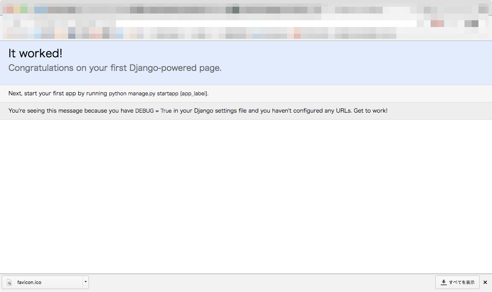

# Django tutorialをやってみる
## 参照先

公式のもの

https://docs.djangoproject.com/ja/1.11/intro/tutorial01/

## インストール
`pip install Django` で終わり。古いバージョンが入っている場合は、別途アンインストールが必要。

環境を壊す可能性があるので、pyenvとかvirtual−envとか使うと良さそう。
（私はいつもpyenvでやっている）
→ なのでanaconda3-4.4.0を入れた。

フレームワークとか新しいものを入れるときはsystemのpythonをいじらないのは共通の認識。

## プロジェクトを作る
`django-admin startproject mysite` を実行すると、mysiteって言うディレクトリが出来る。

### 疑問点のメモ
- [x] `django-admin` ってなにをするコマンドなんですか…
- projectsとかにまとめておいたので、疑問を解決したい → 一応解決した
- `django` ってコマンドがなくて、`django-admin` ってコマンドで操作する
- フォルダとかのtemplateが読み込まれるのは、`startproject` の領分みたい

### やってはいけないこと
- 組み込みとかDjangoのコンポーネントとかぶるような名前
- Webサーバーのドキュメントルート配下にコードを置かない（コードが読み取られてしまうため）

### startproject配下に出来るもの
公式サイトに書いてあるとおり。

- manege.py : プロジェクトに対して操作するためのコマンドラインユーティリティ
- 中に出来ている mysite/ : Pythonパッケージ。importの際に利用
- mysite/settings.py : Djangoプロジェクトの設定ファイル
- mysite/urls.py : URL宣言。
- mysite/wsgi.py : wsgiと使う時にいるらしい。私はそもそもwsgiをしらない。。。

### 開発用サーバーを立ち上げる
nodeとかphpみたいに簡易サーバーを立ち上げるコマンドがある。

`python manage.py runserver`

ポート番号指定して起動することも可能。
`python manage.py runserver 8080`

サーバーのIPを指定する場合は、ポート番号も一緒に指定する。
`python manage.py runserver 0:8080`

※ ここでの0は0.0.0.0のショートカット
詳細はココを見る [https://docs.djangoproject.com/ja/1.11/ref/django-admin/#django-admin-runserver](https://docs.djangoproject.com/ja/1.11/ref/django-admin/#django-admin-runserver)

デフォルトで `127.0.0.1` で立ち上がるとか書いてある。
DjangoはWebフレームワークであって、サーバーではないですよ、本番環境は別のサーバーに乗せてあげてね、とある。

寄り道：faviconを表示してみたい。
-> StackOverFlowに書いてある記事を参考にしてみたけど、上手くいかなかったのでissue行き。
-> 開発サーバー起動だと、静的ファイルのアクセスに制限があるっぽい。詳細は個々を見る〜とか書いてあるドキュメント内に記載がある。

## Polls アプリケーションを作る

プロジェクトの中に、アプリケーションは複数含めることが出来る。
アプリケーションは1機能、プロジェクトは設定とアプリケーションを集めたもの、という認識があるため。

というわけで、pollsを作ります。
`python manage.py startapp polls`

### viewを作る

`polls/views.py` を編集する。ビューを呼ぶためにはURLの対応付が必要。
対応付にはURLconf(urls.py）ファイルを作る必要がある。
`polls/urls.py` を編集する。その後、polls.urls モジュールの記述反映のため、`mysite/urls.py` に `django.conf.urls.include` のimportを追加する。 `urlpatterns` のリストに `include()` を挿入する。

*このあたり、丸写しだけど定型文なんだろうか？*

`'^polls/'` のように末尾にスラッシュを必ず付けておくこと。
Djangoは、include() をみて、一致したURLを切り落としてincludeされたURLConfへ一致したURL部分を落として次の処理へ渡す
-> この部分、URL変更とかに強くて、とても賢い…！

`admin.site.urls` だけは唯一の例外。

url()の引数:
- regex 正規表現でヒットさせることが出来る。複雑なものを渡すとパフォーマンスが微妙になる。
- view  Djangoはマッチする正規表現を見つけると、指定したview関数を呼び出す
- kwargs  任意のキーワード引数を辞書として対象のビューに渡せる（チュートリアルではやらない）
- name  名前付けをすると、Djangoのどこからでも参照できる。テンプレートで特に有効。

